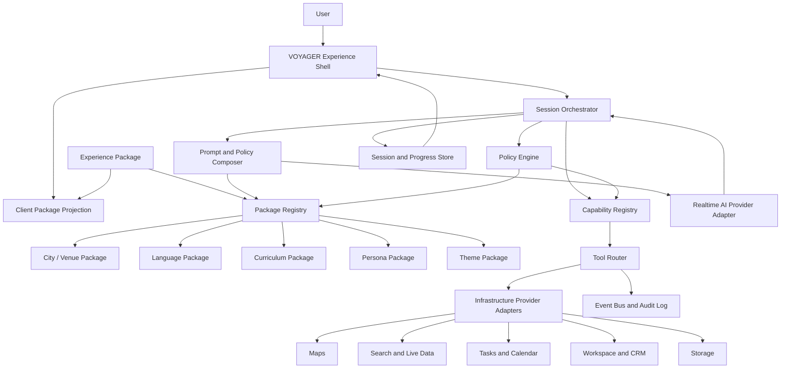

# VOYAGER 2.0 Platform Blueprint

## 1. Executive Summary

VOYAGER 2.0 should become a reusable AI companion platform for place-based language immersion, local navigation, cultural interpretation, and real-world task coaching. The current VOYAGER NYC application proves the product thesis: a live voice agent can help a Spanish-speaking traveler explore New York City while learning practical English through maps, scenarios, transit guidance, vocabulary, pronunciation coaching, missions, and progress tracking.

The next platform step is to separate the reusable VOYAGER engine from city-specific and language-specific content. New York City should become the first city package, Spanish-to-English should become the first language package, and Gemini Live should become the first realtime AI provider behind a replaceable provider interface.

This blueprint now treats VOYAGER as a long-lived platform, not a refactor of the current prototype. Its most important architectural commitment is a clean separation between:

- Core Platform: stable runtime, contracts, policy, orchestration, identity, persistence, observability, and package governance.
- Capabilities: user-facing product abilities such as conversation, maps, routing, translation, learning progress, task sync, booking, and live local data.
- Experience Packages: composed products that choose a brand, persona, city, language pair, curriculum, UI surface, and enabled capabilities.
- City Packages: local content and behavior for places, transit, culture, safety, events, and scenarios.
- Infrastructure Providers: replaceable vendors such as Gemini, Google Maps, Firebase, Google Workspace, storage, search, and future AI or map providers.

The platform should support many future deployments:

- VOYAGER NYC for Spanish-speaking visitors learning English in New York.
- VOYAGER Paris for English-speaking visitors learning French in Paris.
- VOYAGER Tokyo for travelers learning survival Japanese.
- VOYAGER Campus for universities, museums, venues, or neighborhoods.
- White-labeled local guide companions for hospitality, tourism, education, and relocation.

## 2. Current State

The repository currently contains a React/Vite frontend, an Express server, and a WebSocket bridge to Gemini Live. The core product experience is implemented in a single city context: New York City. Important architectural observations:

- The app shell supports full-screen and widget modes.
- `LiveAgent` owns most realtime UX state: connection, audio, language mode, map state, lesson state, travel planner state, progress state, lead capture, reviews, and chat history.
- `server.ts` owns Gemini Live session creation, system instructions, tool declarations, tool call handling, fallback model behavior, web search, time lookup, map action forwarding, progress forwarding, local lead storage, reviews, and Google Workspace writes.
- `src/constants.ts` contains platform behavior, NYC knowledge, bilingual persona rules, landmark data, subway data, curriculum data, tool policy, and lesson protocol in one place.
- City features exist as concrete NYC components: map, subway guide, subway map, destinations, landmarks, travel phrases, and NYC-specific missions.
- Language support is currently centered on English and Spanish, with Spanish as the dominant guided conversation language.
- Integrations include Gemini Live, Google Maps Platform, Firebase Auth, Google Tasks, Google Sheets, Gmail, Calendar, Drive, and a DuckDuckGo HTML search helper.

This is a strong prototype, but its boundaries are not yet platform boundaries. VOYAGER 2.0 should preserve the working experience while introducing explicit package contracts and runtime composition.

## Chief Architect Review

The original blueprint sets the right direction, but several decisions must be challenged before implementation begins.

### Decision Challenges

| Current Assumption | Risk | Refined Position |
| --- | --- | --- |
| "Plugins add capabilities." | The word plugin can blur product capability, package content, and provider adapter into one bucket. | Capabilities are stable platform contracts. Plugins are one delivery mechanism. Providers are infrastructure bindings. |
| "City packages define local behavior." | City packages may become dumping grounds for UI copy, pedagogy, provider config, and tenant customization. | City packages own local truth. Experience packages compose city, language, curriculum, persona, theme, and capability selections. |
| "Language packages define localization and teaching." | UI localization, speech pedagogy, translation rules, and assessment rubrics may evolve independently. | Keep language package modular internally: localization, pedagogy, pronunciation, translation, rubric, and voice policies. |
| "Provider independence." | Provider abstraction can become too thin if it mirrors Gemini Live or Google Maps details. | Define capability-level contracts first, then adapt providers to those contracts. Provider APIs must never leak into package schemas. |
| "Prompt composition." | Prompt fragments can become the hidden application layer. | Treat prompts as generated artifacts from typed policies, not as the source of business logic. Every model affordance needs a non-prompt contract. |
| "Progress events." | Scoring can become opaque, inconsistent, or hard to audit across models and languages. | Progress must be event-sourced, explainable, versioned by rubric, and separable from friendly user-facing feedback. |
| "Operator console later." | Without governance early, packages will drift and create migration debt. | Add package validation, compatibility rules, review states, and provenance before a full console exists. |
| "Local JSON initially." | Prototype storage can harden into production state with weak privacy and migration paths. | Local storage is a dev adapter only. Define the production data model before implementing platform extraction. |

### Missing Concepts Added by This Review

- Capability contracts as first-class architecture.
- Experience packages as the composition boundary for products.
- Tenant and deployment isolation.
- Package lifecycle, provenance, compatibility, and review state.
- Policy engine for permissions, safety, consent, and model/tool access.
- Offline and degraded-mode behavior.
- Event-sourced learning and operational audit trail.
- Provider portability tests.
- Versioned schemas and migration rules.
- Extension points for future devices, modalities, marketplaces, and local operators.

## 3. Vision

VOYAGER is an AI-native travel and learning platform that turns real places into interactive language classrooms.

The platform should help users:

- Speak in realistic local situations before and during a trip.
- Understand local transportation, etiquette, vocabulary, and cultural norms.
- Navigate places with maps, routes, and curated local knowledge.
- Practice pronunciation, grammar, confidence, listening, and naturalness in context.
- Save missions, notes, phrases, and progress across sessions.
- Switch between guide, tutor, translator, listener, and coach modes without losing context.

The platform should help operators:

- Launch a new city or venue without rewriting the app.
- Compose a product from city packages, language packages, lesson packs, and plugins.
- Connect local data sources and business systems through stable integration interfaces.
- Measure learning and usage outcomes without exposing unnatural metrics to the companion conversation.

## 4. Core Principles

### 4.1 Platform over App

The core product is not "NYC Spanish-English travel tutor." That is the first configured experience. The platform must provide common runtime capabilities while city, language, curriculum, and brand behavior live in packages.

### 4.2 Place-Based Learning

Lessons should be anchored in real actions: ordering coffee, asking for directions, buying tickets, checking into a hotel, using transit, asking for help, or making small talk. Language learning is strongest when attached to a concrete local moment.

### 4.3 Conversation First, UI Second

The voice companion is the primary interface. Visual panels should support the conversation with maps, vocabulary, missions, route details, and progress, but they should not become the product's center of gravity.

### 4.4 Natural Companionship

The agent should feel like a warm local companion, not a dashboard reading scores aloud. Progress, metrics, and corrections should be recorded quietly and surfaced through thoughtful UI only when useful.

### 4.5 Configurable Locality

Every place-bound concept must be package-owned: landmarks, neighborhoods, transit systems, fares, etiquette, emergency guidance, local phrases, suggested routes, images, and missions.

### 4.6 Configurable Language Pedagogy

Every language pair must define its own teaching strategy: common pronunciation difficulties, grammar traps, politeness norms, phrase scaffolds, transliteration rules, speaking speed, and correction style.

### 4.7 Provider Independence

Gemini Live is the first realtime AI provider, not the platform itself. VOYAGER should support replaceable AI, search, map, storage, auth, task, and messaging providers.

### 4.8 Safety and Trust

The platform should distinguish verified data, live data, inferred guidance, and model-generated coaching. For navigation, pricing, hours, transit status, weather, emergencies, medical advice, and legal information, VOYAGER must prefer current provider data and communicate uncertainty.

## 5. Target Users and Operators

### 5.1 End Users

- Travelers preparing for a trip.
- Visitors actively navigating a city.
- Immigrants, students, and workers learning local language in context.
- Families or groups who need translation and cultural support.
- Language learners who prefer practical immersion over abstract lessons.

### 5.2 Operators

- Tourism boards.
- Hotels and hospitality groups.
- Museums, campuses, venues, and attractions.
- Language schools and immersion programs.
- Relocation and international student services.
- Local experience marketplaces.

## 6. Product Surfaces

### 6.1 Companion App

The primary full-screen experience for active learning, planning, maps, lessons, and progress.

### 6.2 Embeddable Widget

A lightweight assistant that can be embedded on city, venue, school, or hospitality websites.

### 6.3 Mobile Companion

The natural long-term surface for in-city use: audio-first, map-aware, offline-friendly, and location-aware where the user grants permission.

### 6.4 Operator Console

A future administrative surface for package authors and operators to manage city data, lesson packs, integrations, analytics, content review, and deployment settings.

### 6.5 API

A platform API for sessions, packages, content, tools, user progress, saved notes, and integrations.

## 7. Platform Boundary Model

VOYAGER 2.0 should be designed around boundaries that remain stable for a decade. The central rule: content chooses capabilities, capabilities call providers, and providers never define the product model.

### 7.1 Core Platform

The Core Platform is the smallest durable kernel. It should know how to load an experience, enforce policy, run sessions, route events, invoke capabilities, persist state, observe behavior, and validate packages. It should not know that NYC has subway lines, that Spanish speakers struggle with certain English phonemes, or that Google Maps renders the map.

Core Platform responsibilities:

- Identity, tenancy, roles, permissions, consent, and entitlement.
- Experience resolution and package dependency graph loading.
- Session orchestration for voice, text, events, tools, and state.
- Capability registry and invocation lifecycle.
- Policy engine for safety, privacy, data access, and tool eligibility.
- Event bus and durable audit log.
- Storage contracts and migrations.
- Package registry, schema validation, compatibility checks, and provenance.
- Observability, evaluation, and quality gates.

Core Platform must not contain:

- City-specific landmarks, transit rules, or etiquette.
- Language-pair teaching rules.
- Provider-specific API shapes.
- Tenant-specific branding, copy, offers, or data.
- Hardcoded lesson content.

### 7.2 Capabilities

Capabilities are stable product abilities exposed to experiences and agents. They are not vendors and not UI components.

Examples:

- `conversation.realtime`
- `conversation.text`
- `translation.bidirectional`
- `learning.progress`
- `learning.roleplay`
- `places.lookup`
- `places.recommend`
- `routes.plan`
- `transit.status`
- `weather.current`
- `events.discover`
- `tasks.sync`
- `notes.save`
- `booking.reserve`
- `payments.collect`
- `notifications.send`

Each capability should define:

- Public contract and version.
- Required permissions and consent.
- Input and output schemas.
- Event types.
- Agent tool schemas, if model-callable.
- Client projection, if visible.
- Provider adapter interface.
- Failure and degraded-mode semantics.
- Evaluation criteria.

### 7.3 Experience Packages

An Experience Package is the product composition boundary. It answers: "What exactly is this deployed VOYAGER?"

An experience package selects:

- Brand and theme.
- Persona package.
- City or venue package.
- Language package.
- Curriculum package.
- Enabled capabilities.
- Default modes and UI surfaces.
- Operator-owned content overrides.
- Required providers and acceptable fallbacks.
- Deployment profile constraints.

Examples:

- `experience.voyager-nyc.es-en.traveler`
- `experience.voyager-paris.en-fr.museum-weekend`
- `experience.voyager-campus.international-students`

### 7.4 City and Venue Packages

City packages own local truth. Venue packages should use the same model at smaller scope for museums, campuses, airports, stadiums, resorts, hospitals, or neighborhoods.

City and venue packages may reference capabilities, but they should not implement them. A city package can say that it needs `transit.status`; it should not know whether that status comes from GTFS, MTA, Google, a city API, or a cached provider.

### 7.5 Infrastructure Providers

Infrastructure Providers are replaceable technical bindings.

Examples:

- AI provider: Gemini Live today, future OpenAI or local realtime models later.
- Maps provider: Google Maps today, Mapbox or Apple Maps later.
- Auth provider: Firebase today, Auth0, Cognito, or first-party identity later.
- Storage provider: local development adapter today, managed database later.
- Search provider: simple web search today, commercial search or local index later.
- Workspace provider: Google Workspace today, Microsoft 365 or CRM systems later.

Provider adapters must satisfy capability contracts. They do not define domain models, package schemas, or product behavior.

### 7.6 Tenant and Deployment Profiles

A tenant is an operator or customer boundary. A deployment profile binds an experience package to a runtime environment.

Tenant-owned settings:

- Brand, allowed packages, enabled capabilities, user data retention, analytics policy, and operator integrations.

Deployment-owned settings:

- Environment, domains, secrets, provider bindings, rate limits, region, compliance profile, and feature flags.

This distinction matters: a hotel chain may operate multiple experience packages across many cities, while each deployment may use different provider bindings or data residency rules.

## 8. Domain Model

VOYAGER 2.0 should use a domain model that separates stable platform entities from package-specific content.

### 8.1 Platform

The reusable runtime that loads packages, starts sessions, connects providers, routes tool calls, stores state, and renders configured experiences.

Key fields:

- `platformVersion`
- `enabledCapabilities`
- `providerBindings`
- `policyProfile`
- `deploymentProfile`

### 8.2 Experience

A configured product assembled from packages.

Examples:

- `voyager-nyc-es-en`
- `voyager-paris-en-fr`
- `voyager-campus-international-students`

Key fields:

- `experienceId`
- `displayName`
- `brand`
- `defaultCityPackage`
- `defaultLanguagePackage`
- `enabledPlugins`
- `uiShell`
- `launchModes`

### 8.2.1 Capability

A versioned product contract that can be enabled by an experience and fulfilled by one or more providers.

Key fields:

- `capabilityId`
- `version`
- `contract`
- `requiredPermissions`
- `requiredConsent`
- `toolSchemas`
- `eventSchemas`
- `clientProjection`
- `providerAdapterInterface`
- `degradedMode`
- `evaluationSuite`

### 8.2.2 Tenant

An operator, customer, or organization boundary.

Key fields:

- `tenantId`
- `name`
- `allowedPackages`
- `enabledCapabilities`
- `dataRetentionPolicy`
- `analyticsPolicy`
- `operatorIntegrations`
- `complianceProfile`

### 8.2.3 Deployment Profile

A binding between an experience and a runtime environment.

Key fields:

- `deploymentId`
- `experienceId`
- `environment`
- `domains`
- `regions`
- `providerBindings`
- `secretRefs`
- `featureFlags`
- `rateLimits`
- `fallbackPolicy`

### 8.2.4 Provider Binding

The configuration that connects a capability to a concrete infrastructure provider.

Key fields:

- `providerBindingId`
- `capabilityId`
- `providerType`
- `providerName`
- `adapterVersion`
- `secretRefs`
- `quotaPolicy`
- `healthCheck`
- `fallbackProviderBindingId`

### 8.3 City Package

A package that defines place-specific knowledge and behavior.

Key fields:

- `cityId`
- `name`
- `country`
- `timeZone`
- `defaultMapCenter`
- `places`
- `neighborhoods`
- `transitSystems`
- `routes`
- `scenarios`
- `localEtiquette`
- `safetyGuidance`
- `mediaAssets`
- `dataSources`

### 8.4 Language Package

A package that defines language-pair pedagogy and localization.

Key fields:

- `languagePackageId`
- `sourceLanguage`
- `targetLanguage`
- `conversationDefaultLanguage`
- `voiceProfile`
- `pronunciationRules`
- `grammarPatterns`
- `correctionStyle`
- `translationRules`
- `uiTranslations`
- `phraseTemplates`

### 8.5 Persona Package

A configurable companion identity.

Key fields:

- `personaId`
- `name`
- `tone`
- `roles`
- `greetingProtocol`
- `conversationConstraints`
- `voicePronunciationOverrides`
- `modeBehaviors`

### 8.6 Curriculum Package

A structured learning path independent of a specific UI component.

Key fields:

- `curriculumId`
- `levels`
- `lessons`
- `objectives`
- `vocabulary`
- `missions`
- `rolePlays`
- `assessments`
- `completionRules`

### 8.7 Place

A normalized local entity.

Key fields:

- `placeId`
- `name`
- `localizedNames`
- `category`
- `coordinates`
- `description`
- `localizedDescriptions`
- `tags`
- `openingHoursSource`
- `bookingLinks`
- `accessibility`
- `safetyNotes`

### 8.8 Transit System

A city-owned mobility model.

Key fields:

- `transitSystemId`
- `name`
- `modes`
- `fareRules`
- `paymentMethods`
- `lines`
- `stations`
- `vocabulary`
- `tips`
- `liveStatusProvider`

### 8.9 Scenario

A real-world learning situation.

Key fields:

- `scenarioId`
- `title`
- `placeContext`
- `difficulty`
- `roles`
- `targetPhrases`
- `vocabulary`
- `culturalNotes`
- `successCriteria`
- `relatedMissions`

### 8.10 Mission

A concrete task that can be practiced, completed, synced, or reviewed.

Key fields:

- `missionId`
- `scenarioId`
- `title`
- `localizedTitle`
- `instructions`
- `completionSignal`
- `evidence`
- `syncTargets`

### 8.11 Session

A live or text conversation instance.

Key fields:

- `sessionId`
- `experienceId`
- `userId`
- `selectedCityPackage`
- `selectedLanguagePackage`
- `activeMode`
- `transcript`
- `toolEvents`
- `progressEvents`
- `sessionMemory`

### 8.12 Progress Profile

The user's learning state.

Key fields:

- `userId`
- `languagePackageId`
- `completedMissions`
- `learnedVocabulary`
- `pronunciationPatterns`
- `skillSignals`
- `confidenceSignals`
- `reviewHistory`

### 8.13 Package Version

A published, immutable package artifact with compatibility metadata.

Key fields:

- `packageId`
- `packageType`
- `version`
- `schemaVersion`
- `compatiblePlatformRange`
- `dependencies`
- `provenance`
- `reviewState`
- `migrationNotes`
- `deprecationPolicy`

### 8.14 Policy

A machine-enforceable rule set for safety, permissions, privacy, and provider access.

Key fields:

- `policyId`
- `scope`
- `rules`
- `decisionMode`
- `auditRequirements`
- `overrideRules`
- `effectiveFrom`
- `effectiveTo`

## 9. Platform Architecture

### 9.1 Logical Architecture



### 9.2 Runtime Layers

#### Experience Shell

Owns the visible product surface: full app, widget, mobile, or operator preview. It should not hardcode a city, language pair, lesson list, or provider. It receives an `ExperienceConfig` and renders enabled capabilities.

Responsibilities:

- Load experience configuration.
- Render companion controls, maps, lesson panels, mission panels, progress, notes, and reviews.
- Manage local UI state.
- Connect to the Session Orchestrator.
- Display tool results from the server.
- Render only the safe client projection of packages and capability state.
- Support degraded states when a capability or provider is unavailable.

#### Session Orchestrator

Owns conversation lifecycle and realtime communication.

Responsibilities:

- Start, resume, pause, and end sessions.
- Connect client audio and text to the selected AI provider.
- Maintain active mode: guide, tutor, translator, monitor, bilingual, language-only, or review.
- Normalize provider events into platform events.
- Route model tool calls to platform tools.
- Emit client events for audio, text, map actions, progress updates, and errors.
- Enforce tenant, deployment, user, and session policy before invoking capabilities.
- Record session events to the event bus for audit, replay, analytics, and evaluation.

#### Capability Registry

Owns the platform's product-level abilities. The registry exposes stable capability contracts and maps those contracts to provider adapters at runtime.

Responsibilities:

- Register capability versions and schemas.
- Resolve which capabilities an experience may use.
- Expose model-callable tools for eligible capabilities.
- Expose client-visible capability projections.
- Define degraded-mode behavior.
- Route capability calls to provider bindings.
- Run capability contract tests against providers.

#### Policy Engine

Owns runtime decisions about what the agent, user, package, tenant, and provider are allowed to do.

Responsibilities:

- Enforce consent requirements before audio recording, transcript storage, location use, task sync, or third-party writes.
- Enforce package and tenant permissions.
- Gate tools by mode, user role, location, age/compliance profile, and provider health.
- Redact or suppress sensitive content.
- Produce auditable allow, deny, or require-confirmation decisions.

#### Prompt and Policy Composer

Builds model instructions from reusable and package-specific sources.

Inputs:

- Platform conversation policy.
- Persona package.
- City package.
- Language package.
- Curriculum context.
- Active mode.
- User profile and session memory.
- Tool availability.

Outputs:

- System instruction.
- Tool declarations.
- Safety and uncertainty rules.
- Mode-specific instructions.

#### Tool Router

Receives model function calls, validates them, executes the correct capability, and returns structured responses. It should route to providers only through capability adapters.

Responsibilities:

- Validate arguments by schema.
- Enforce permission and policy rules.
- Map generic tool names to provider-specific implementations.
- Emit UI events when tools affect the client.
- Log tool events for audit and progress.
- Normalize failures into user-safe messages and machine-readable error events.

#### Package Content Runtime

Loads and validates package content.

Responsibilities:

- Resolve the active city, language, curriculum, and persona package.
- Validate package schemas.
- Provide localized content to UI and prompt composer.
- Version packages independently from platform code.
- Support package inheritance and overrides.
- Track provenance, review state, compatibility, migrations, and deprecation.
- Produce separate server and client package projections.

#### Integration Adapters

Provider-specific modules behind stable interfaces.

Initial adapters:

- Realtime AI: Gemini Live.
- Maps and routing: Google Maps Platform.
- Search: web search provider.
- Auth: Firebase Auth.
- Tasks: Google Tasks.
- Workspace: Google Sheets, Gmail, Calendar, Drive.
- Storage: local JSON initially, database later.

## 10. Package System

### 10.1 Package Types

VOYAGER should support these package types:

- `experience`: product composition, enabled capabilities, default packages, launch surfaces, and deployment expectations.
- `city`: local geography, transit, places, scenarios, safety, data providers.
- `venue`: scoped local package for museums, airports, campuses, hotels, venues, neighborhoods, and resorts.
- `language`: source-target pedagogy, localization, correction rules, pronunciation.
- `curriculum`: lessons, missions, exercises, role plays, assessment rules.
- `persona`: brand voice, companion identity, greetings, mode behavior.
- `theme`: visual tokens, imagery, icon treatment, layout preferences.
- `integration`: provider bindings and external system configuration.
- `deployment`: environment, secrets, feature flags, tenant settings.
- `policy`: package-scoped rules for safety, consent, privacy, and tool eligibility.
- `evaluation`: test fixtures, expected behaviors, prompt snapshots, and quality gates for packages.

### 10.2 Package Manifest

Each package should include a manifest:

```json
{
  "id": "city.nyc",
  "type": "city",
  "name": "New York City",
  "version": "1.0.0",
  "compatiblePlatform": "^2.0.0",
  "schemaVersion": "1.0.0",
  "defaultLocale": "en-US",
  "supportedLocales": ["en-US", "es-ES"],
  "dependencies": [],
  "capabilities": ["places.lookup", "routes.plan", "transit.status"],
  "reviewState": "draft",
  "provenance": {
    "author": "VOYAGER",
    "source": "first-party",
    "createdAt": "2026-07-13"
  },
  "entrypoints": {
    "places": "./places.json",
    "transit": "./transit.json",
    "scenarios": "./scenarios.json",
    "media": "./media.json"
  }
}
```

### 10.3 Package Loading

Package loading should happen server-side first, then expose a safe client projection.

Server projection:

- Full prompt content.
- Tool schemas.
- provider configuration.
- private policy metadata.

Client projection:

- UI copy.
- public place and lesson data.
- map defaults.
- visual assets.
- visible feature flags.

### 10.4 Package Lifecycle

Packages should move through explicit states:

- `draft`: editable and not deployable to production.
- `validated`: schema-valid and dependency-valid.
- `reviewed`: approved by a human or trusted workflow.
- `published`: immutable and deployable.
- `deprecated`: still available but should not be used for new experiences.
- `retired`: unavailable except for archival replay.

Rules:

- Published packages are immutable. Changes create a new version.
- Packages must declare schema version, platform compatibility, dependencies, and required capabilities.
- Package validation must run before any package can be attached to an experience.
- Package migrations must be explicit and testable.
- Runtime should refuse incompatible package graphs rather than attempting best-effort loading.

### 10.5 Package Extension Points

Packages should support controlled extension without forking.

Extension mechanisms:

- `overrides`: tenant or experience-specific replacement values.
- `composition`: multiple packages combined through declared precedence.
- `slots`: named extension locations such as additional lessons, places, panels, tools, or phrases.
- `references`: links to shared package resources.
- `patches`: versioned, reviewed changes applied at package-load time.
- `locales`: additional localizations without changing core package data.

Extension guardrails:

- Overrides cannot weaken platform safety policy.
- Tenant content cannot mutate first-party package artifacts.
- Capability requirements must remain explicit after composition.
- Package projections must prevent private prompt and provider metadata from reaching the client.

### 10.6 Compatibility Strategy

VOYAGER should use semantic versioning for package schemas, capability contracts, and provider adapter interfaces.

Compatibility checks:

- Platform version satisfies package `compatiblePlatform`.
- Capability version satisfies experience requirements.
- Provider binding satisfies capability adapter interface.
- Language package supports experience source and target locales.
- City package supports requested locales or has fallback localization.
- Theme package supports selected surface.
- Policy package does not conflict with tenant compliance profile.

## 11. Experience Packages

### 11.1 Purpose

Experience packages are the deployable product definition. They compose city, venue, language, curriculum, persona, theme, policy, and capability selections into a coherent user experience.

An experience package should answer:

- Who is this for?
- Where is it used?
- Which languages are active?
- Which companion persona is active?
- Which capabilities are enabled?
- Which surfaces are available?
- Which provider bindings are required or optional?
- Which tenant or operator customizations are allowed?

### 11.2 Experience Package Contents

An experience package should include:

- Experience metadata: name, audience, default locale, supported launch surfaces.
- Package graph: city or venue, language, curriculum, persona, theme, policy, and evaluation packages.
- Capability plan: required, optional, disabled, and fallback capabilities.
- Mode plan: default mode, available modes, mode transition rules.
- UI composition: visible panels, panel order, widget/full app/mobile differences.
- Prompt composition policy: which package fragments participate in each mode.
- Provider requirements: capability-level requirements without vendor-specific leakage.
- Tenant override slots: approved areas for operator customization.
- Evaluation suite: minimum tests before publishing.

### 11.3 Anti-Patterns

Avoid:

- Putting city data directly in an experience package.
- Putting provider secrets or vendor API structures in an experience package.
- Encoding language pedagogy directly in the experience package.
- Forking an experience package for every operator when tenant overrides would suffice.
- Treating an experience package as a UI route rather than a product contract.

## 12. City Packages

### 12.1 Purpose

City packages define what makes a VOYAGER experience local. NYC should be extracted from current hardcoded constants and component data into `city.nyc`.

### 12.2 City Package Contents

A city package should include:

- City metadata: name, region, country, timezone, emergency numbers, default coordinates.
- Places: landmarks, museums, parks, restaurants, neighborhoods, stations, venues.
- Transit: systems, lines, stations, fare guidance, payment methods, vocabulary, live status sources.
- Local scenarios: cafe, transit, museum, hotel, market, restaurant, theater, airport, pharmacy, emergency, local etiquette.
- Cultural notes: tipping, queueing, small talk, politeness, safety norms.
- Navigation templates: route explanation style, common direction phrases, neighborhood orientation.
- Media: hero images, map markers, route overlays, lesson illustrations.
- Data source bindings: maps, transit feeds, city open data, event feeds, tourism APIs.

### 12.3 NYC Package Extraction

Current NYC-specific data to extract:

- `NYC_LANDMARKS`
- `NYC_SUBWAY_INFO`
- `TRAVEL_PRESETS`
- Subway guide content.
- NYC suggested tasks.
- NYC-specific lesson scenarios.
- NYC-specific map defaults.
- NYC-specific prompt rules and landmark references.
- NYC-specific UI labels such as "VOYAGER NYC Immersion."

### 12.4 Future City Package Examples

Paris:

- Metro and RER guidance.
- Cafe ordering etiquette.
- Museum ticketing scenarios.
- French greetings and politeness levels.
- Neighborhood package for arrondissements.

Tokyo:

- Train and subway navigation.
- Convenience store interactions.
- Restaurant ordering and ticket machines.
- Politeness levels and survival phrases.
- Script support for kana, romaji, and English.

Miami:

- Spanish-English bilingual city package.
- Airport, rideshare, beach, restaurant, and nightlife scenarios.
- Local transit and tourism integrations.

## 13. Language Packages

### 13.1 Purpose

Language packages define how VOYAGER teaches, translates, corrects, and speaks for a source-target language pair. Spanish-to-English should become the first language package, not a global assumption.

### 13.2 Language Package Contents

A language package should include:

- Source language and target language.
- Default conversation language.
- UI localization.
- Voice speed and clarity rules.
- Translation mode rules.
- Bilingual mode rules.
- Grammar correction patterns.
- Pronunciation patterns.
- Common false friends.
- Politeness and register guidance.
- Script, transliteration, or romanization rules where needed.
- Rubric definitions for hidden progress scoring.
- Phrase generation templates.

### 13.3 Spanish-to-English Package Extraction

Current Spanish-to-English rules to extract:

- Spanish default conversation behavior.
- English-only teaching exceptions.
- Spanish-speaker pronunciation patterns.
- Common accent issues such as `v/b`, `ship/sheep`, `live/leave`, and `thirty/dirty`.
- Slower English speech rule.
- Translation mode behavior.
- Bilingual mode behavior.
- Existing English and Spanish UI strings.

### 13.4 Multi-Language Support

The platform should support:

- One source language to one target language.
- Bidirectional translation mode.
- Multilingual UI localization.
- Multiple target dialects, such as US English, UK English, Mexican Spanish, Castilian Spanish, Quebec French, or Brazilian Portuguese.
- Per-language pronunciation and voice settings.

## 14. Capability and Plugin Architecture

This section should be read as capability architecture first and plugin mechanics second. A capability is a stable platform contract. A plugin is a deployable module that can implement or extend a capability. A provider adapter is the infrastructure bridge that lets a capability use a vendor or service.

### 14.1 Capability Design Rules

Capabilities must be designed from user intent and platform contracts, not from vendor APIs.

Rules:

- Name capabilities by product ability, not provider action.
- Version capability contracts independently from providers.
- Keep provider-specific fields out of package schemas.
- Require explicit consent and permissions for capabilities that touch user data, location, third-party accounts, payments, or notifications.
- Define failure semantics before provider implementation.
- Define whether a capability is model-callable, user-invoked, system-invoked, or operator-invoked.
- Define client-visible events separately from internal audit events.
- Provide test fixtures and conformance tests for every capability.

### 14.2 Capability Invocation Lifecycle

Every capability invocation should move through a standard lifecycle:

1. Request created by user, model, system, or operator.
2. Policy engine evaluates permission, consent, mode, tenant, and safety rules.
3. Capability validates input schema and package context.
4. Provider binding is selected by deployment profile and health.
5. Provider adapter executes the request.
6. Result is normalized to the capability output schema.
7. Events are emitted to client, session state, analytics, and audit log as appropriate.
8. Degraded or fallback behavior runs if provider execution fails.

### 14.3 Extension Point Taxonomy

VOYAGER should support multiple kinds of extension points:

- Content extension: new places, lessons, phrases, missions, etiquette notes, media.
- Capability extension: new product abilities such as booking, payments, AR guidance, or group travel.
- Provider extension: new vendors for existing capabilities.
- Surface extension: new client panels, mobile surfaces, kiosks, watches, car displays, or browser widgets.
- Policy extension: tenant-specific safety, privacy, compliance, and escalation rules.
- Evaluation extension: package-specific test suites, rubrics, simulation scripts, and golden transcripts.
- Analytics extension: operator dashboards, learning outcomes, conversion funnels, and quality metrics.

Each extension point needs an owner, schema, compatibility strategy, and testing story.

### 14.4 Plugin Purpose

Plugins add or implement capabilities without binding them to one city, one UI, or one infrastructure vendor.

Plugin categories:

- Realtime AI providers.
- Maps and routing.
- Transit live status.
- Weather.
- Events.
- Search.
- Translation.
- Speech analysis.
- Progress analytics.
- Task sync.
- CRM and lead capture.
- Booking and reservations.
- Payments.
- Notifications.
- Content management.

### 14.5 Plugin Contract

Each plugin should declare:

- `pluginId`
- `capability`
- `toolSchemas`
- `serverHandlers`
- `clientEventTypes`
- `requiredSecrets`
- `permissions`
- `rateLimits`
- `healthCheck`
- `packageCompatibility`

### 14.6 Initial Plugins

#### Realtime Companion Plugin

Wraps Gemini Live and future realtime AI providers.

Generic capabilities:

- Connect session.
- Send realtime audio.
- Send text turn.
- Receive audio.
- Receive transcript.
- Receive tool calls.
- Handle provider fallback.

#### Maps Plugin

Wraps Google Maps Platform.

Generic tools:

- `show_place`
- `draw_route`
- `search_nearby`
- `geocode`
- `reverse_geocode`

#### Progress Plugin

Records learning signals without exposing unnatural metric text to the user.

Generic tools:

- `record_progress`
- `complete_mission`
- `add_vocabulary`
- `add_pronunciation_pattern`
- `generate_review`

#### Tasks Plugin

Syncs missions and itinerary tasks.

Initial provider:

- Google Tasks.

#### Workspace Plugin

Handles operator workflows.

Initial providers:

- Google Sheets for leads and transcripts.
- Gmail for alerts.
- Calendar for appointments.
- Drive for generated documents.

#### Live Data Plugin

Provides current information.

Initial providers:

- Web search.
- Weather provider.
- Transit status provider.
- Events provider.

### 14.7 Tool Naming

Tool names should be generic at platform level and mapped to package intent.

Current names:

- `map_show_location`
- `map_draw_route`
- `get_current_time`
- `search_web`
- `update_user_progress`

Recommended platform names:

- `places.show`
- `routes.draw`
- `time.current`
- `live_data.search`
- `learning.record_progress`
- `missions.complete`
- `notes.save`
- `tasks.sync`

## 15. Data and Integrations

### 15.1 Data Classes

VOYAGER should distinguish:

- Static package data: package-owned landmarks, lessons, vocabulary, etiquette.
- Operator data: tenant settings, custom places, curated routes, offers, business rules.
- User data: profile, saved notes, completed missions, vocabulary, preferences.
- Session data: transcripts, tool events, audio metadata, progress events.
- Live data: weather, transit status, opening hours, events, prices, web results.
- Analytics data: engagement, completion, retention, learning outcomes, errors.

### 15.2 Storage Strategy

Current local JSON files and in-memory state are acceptable for prototype use. VOYAGER 2.0 should move toward a persistent storage model:

- Relational database for users, experiences, sessions, packages, and missions.
- Object storage for media assets and generated artifacts.
- Event log for tool calls, progress updates, and session lifecycle.
- Cache for live data and provider responses.
- Secrets manager for provider keys.

### 15.3 Integration Strategy

Each integration should be isolated behind an adapter and configured by deployment profile.

Initial provider mappings:

- AI: Gemini Live.
- Maps: Google Maps Platform.
- Auth: Firebase Auth.
- User task sync: Google Tasks.
- Operator sheets: Google Sheets.
- Operator alerts: Gmail.
- Appointments: Google Calendar.
- Documents: Google Drive.
- Web search: current search helper, later replaced by a formal search provider.

### 15.4 Data Freshness

The platform should mark data freshness by source:

- Package data: versioned and reviewed.
- Cached provider data: timestamped.
- Live provider data: timestamped and source-linked when possible.
- Model inference: clearly treated as unverified.

The companion should use live tools for facts likely to change: hours, prices, fares, route status, weather, event availability, transit disruptions, and safety alerts.

### 15.5 Data Ownership and Boundaries

VOYAGER should make ownership explicit:

- First-party platform data: schemas, package registry metadata, capability definitions, system events.
- First-party package data: reviewed city, language, curriculum, persona, theme, policy, and evaluation packages.
- Tenant data: branding, custom content, operator users, business integrations, tenant analytics.
- End-user data: profile, preferences, session history, saved notes, progress, connected accounts.
- Provider data: externally sourced maps, routes, search results, transit status, weather, events, and generated AI responses.

Boundary rules:

- Tenant data must not leak across tenants.
- User data must not be used for another tenant without explicit authorization and policy support.
- Provider data terms must be represented in provider bindings and respected in caching.
- Generated AI content must be traceable to session, model, prompt version, tool context, and package graph.
- Package data should be immutable after publication.

### 15.6 Event-Sourced Audit Trail

The platform should record an append-only event trail for important actions.

Event categories:

- Session lifecycle.
- Package graph loaded.
- Prompt artifact generated.
- Model input and output metadata.
- Tool and capability invocation.
- Provider request and normalized response metadata.
- Consent decision.
- Policy decision.
- Progress event.
- User note or saved item.
- Operator action.
- Error, fallback, and recovery.

The event trail enables replay, debugging, analytics, compliance, model evaluation, and migration. Sensitive payloads may be redacted or stored separately, but the event envelope should remain durable.

### 15.7 Offline and Degraded Modes

VOYAGER will often be used while traveling, where connectivity, provider health, GPS, and API quotas are unreliable. Every capability should define degraded behavior.

Examples:

- Realtime conversation unavailable: fall back to text-only or scripted phrasebook mode.
- Maps unavailable: show cached places, textual directions, or last-known route summary.
- Live transit unavailable: show static transit guidance with freshness warning.
- Search unavailable: answer only from package data and say when live verification is missing.
- Progress storage unavailable: queue local progress events for later sync.
- Provider quota exceeded: switch provider binding or reduce expensive capability calls.

Offline support should be planned at the capability level, not bolted onto UI components.

### 15.8 Provider Portability and Failover

Provider portability is only real if tested. Each provider adapter should pass conformance tests for the capability contract it implements.

Required practices:

- Provider adapters must normalize errors, rate limits, partial responses, and timeouts.
- Deployment profiles should define primary, secondary, and disabled providers per capability.
- Provider health should influence routing.
- Fallback behavior should be observable and user-safe.
- Provider-specific features may exist, but packages must not depend on them unless declared as optional enhancements.

## 16. Prompt and Agent Design

### 16.1 Prompt Composition

The current monolithic `SYSTEM_INSTRUCTION` should become a composed prompt:

1. Platform identity and safety.
2. Persona package.
3. Active language package.
4. Active city package.
5. Active curriculum or scenario.
6. Active mode.
7. Tool policy.
8. User context and session memory.

Prompt composition rules:

- Prompt fragments must be generated from typed package and policy data.
- Prompt artifacts must be versioned, logged, and reproducible for a session.
- Package authors should not be able to bypass platform safety or consent rules through prompt text.
- Prompt changes should run evaluation suites before publishing.
- Tool eligibility should be enforced by policy and schemas, not only by prompt instruction.
- Prompts should reference package facts by structured retrieval where possible instead of copying large static catalogs into every session.

### 16.2 Agent Modes

VOYAGER should support explicit modes:

- Guide: local recommendations, cultural interpretation, itinerary support.
- Tutor: structured language teaching and correction.
- Role-play: scenario practice.
- Translator: bidirectional translation only.
- Monitor: listen-only with text feedback.
- Bilingual: reply in one language, repeat in another.
- Navigation: route and transit-first behavior.
- Review: summarize learning and next steps.

### 16.3 Progress Handling

Progress should be event-based, not bracket-tag based.

Current state uses transcript parsing and model tool calls. VOYAGER 2.0 should standardize progress events:

- `skill_score.recorded`
- `vocabulary.learned`
- `pronunciation.pattern_detected`
- `mission.completed`
- `lesson.started`
- `lesson.completed`
- `review.generated`

The model can still call progress tools, but the user-facing transcript should remain natural.

### 16.4 Memory Model

VOYAGER needs multiple memory scopes:

- Turn memory: current user utterance, agent response, active tool calls.
- Session memory: current trip, active route, lesson state, temporary preferences.
- User memory: stable preferences, learned words, completed missions, pronunciation patterns, saved places.
- Experience memory: package-specific progress and user settings.
- Tenant memory: operator content, analytics, and configuration.
- Platform memory: model/provider performance, package health, aggregate quality metrics.

Memory rules:

- User memory requires consent and deletion support.
- Sensitive facts should be classified and redacted where appropriate.
- Memories should have source, timestamp, confidence, package context, and retention policy.
- Model-generated memory candidates should be reviewed by deterministic rules before persistence.
- Cross-experience memory reuse should be explicit, not automatic.

### 16.5 Model Governance

Realtime AI providers will change over the next decade. VOYAGER should not assume one model family, one tool-calling style, or one audio protocol.

Governance requirements:

- Model registry with supported capabilities, languages, modalities, cost profile, latency profile, and safety profile.
- Prompt and tool compatibility tests per model.
- Golden conversation evaluations per experience package.
- Regression tests for mode switching, translation, progress recording, and navigation.
- Human review workflows for high-impact package or policy changes.
- Model fallback policy by capability and deployment.
- Cost controls per tenant, user, session, and capability.

### 16.6 Agent Boundaries

The agent should never become the authority for platform state. It can propose, narrate, and request actions, but deterministic systems should own state transitions.

Examples:

- The model can call `missions.complete`; the progress service decides whether the mission completion event is valid.
- The model can request `routes.plan`; the routes capability decides provider, route validity, and freshness.
- The model can suggest a booking; the booking capability handles user confirmation and provider execution.
- The model can generate a review; the learning capability records rubric version and evidence.

## 17. Client Architecture

### 17.1 Component Boundaries

Recommended client modules:

- `ExperienceShell`
- `CompanionPanel`
- `ConversationTimeline`
- `AudioControls`
- `ModeControls`
- `MapPanel`
- `CurriculumPanel`
- `MissionPanel`
- `TransitPanel`
- `ProgressPanel`
- `NotesPanel`
- `ReviewPanel`

### 17.2 State Boundaries

Split state into:

- Session connection state.
- Conversation state.
- Active package state.
- UI navigation state.
- Map state.
- Learning progress state.
- Integration auth state.
- Form and review state.

### 17.3 Client Event Protocol

Replace ad hoc WebSocket payloads with a typed event protocol.

Examples:

- `session.connected`
- `session.error`
- `conversation.user_transcript_delta`
- `conversation.agent_transcript_delta`
- `conversation.audio_chunk`
- `map.place_shown`
- `map.route_drawn`
- `learning.progress_updated`
- `language.switched`
- `mode.changed`
- `form.requested`

## 18. Server Architecture

### 18.1 Server Modules

Recommended modules:

- `server/app`
- `server/session/sessionOrchestrator`
- `server/ai/realtimeProvider`
- `server/prompts/promptComposer`
- `server/tools/toolRouter`
- `server/packages/packageRegistry`
- `server/integrations`
- `server/storage`
- `server/events`
- `server/policies`

### 18.2 API Surface

Initial platform APIs:

- `GET /api/experiences/:id`
- `GET /api/packages/:id/client`
- `POST /api/sessions`
- `GET /api/sessions/:id`
- `WS /api/sessions/:id/live`
- `POST /api/sessions/:id/messages`
- `POST /api/progress/events`
- `GET /api/users/:id/progress`
- `POST /api/notes`
- `POST /api/reviews`

The existing `/api/live`, `/api/leads`, and review endpoints can be migrated behind these platform routes.

## 19. Security, Privacy, and Compliance

VOYAGER handles sensitive data: voice, transcripts, locations, learning progress, contact details, and third-party account access.

Required controls:

- Explicit consent for recording, transcript storage, location, and integrations.
- User-visible data deletion path.
- Provider key isolation.
- Least-privilege OAuth scopes.
- Tenant-level data boundaries.
- Audit logs for tool calls and integrations.
- Redaction for secrets and sensitive transcript content.
- Configurable data retention.
- Clear distinction between user data and operator analytics.

Additional platform controls:

- Role-based access for platform admins, tenant admins, content editors, reviewers, support staff, and end users.
- Attribute-based policy checks for capability invocation.
- Data residency controls by deployment region.
- Encryption in transit and at rest.
- Secret rotation and scoped provider credentials.
- Audit views for operator and platform actions.
- Abuse detection for prompt injection, tool misuse, spam, fraud, and unsafe requests.
- Human escalation paths for safety-critical, medical, legal, emergency, payment, and booking flows.
- Child and school deployment profiles where required.
- Vendor data processing inventory for each provider binding.

### 19.1 Trust Boundaries

Trust boundaries should be explicit:

- Browser or mobile client is untrusted.
- Package content is trusted only after validation and review.
- Tenant-authored content is lower trust than first-party reviewed packages.
- Model output is untrusted until normalized by platform contracts.
- Provider responses are trusted according to provider class, freshness, and terms.
- User-provided content can be prompt-injection input and must be treated accordingly.

### 19.2 Consent Ledger

Consent should be recorded as first-class data:

- Audio capture.
- Transcript storage.
- Location access.
- Personalization memory.
- Third-party account connection.
- Task, calendar, email, or document writes.
- Marketing or operator follow-up.
- Analytics beyond essential operations.

Consent records should include scope, timestamp, source surface, package graph, tenant, and revocation status.

## 20. Observability and Quality

The platform should track:

- Session start, connected, disconnected, fallback, error.
- Provider latency and failure rate.
- Tool call success and failure.
- AI provider model fallback frequency.
- Transcript quality and audio errors.
- Map and route rendering success.
- Lesson start and completion.
- Mission completion.
- User review ratings and comments.
- Package validation errors.

Quality gates:

- Package schema validation.
- Prompt snapshot tests.
- Tool schema tests.
- Adapter contract tests.
- End-to-end session smoke tests.
- UI regression checks for core panels.

### 20.1 Evaluation Strategy

VOYAGER needs evaluation at multiple layers:

- Package validation: schema, references, localization, dependencies, capability requirements.
- Prompt evaluation: safety, persona consistency, mode behavior, language behavior, tool-use accuracy.
- Capability evaluation: contract conformance, error handling, fallback behavior, provider portability.
- Experience evaluation: golden conversations, realistic trip scenarios, lesson completion, map interactions.
- Production evaluation: sampled transcripts, user reviews, failure clusters, provider latency, cost anomalies.

### 20.2 Release Gates

Before production release:

- Package graph validates.
- Required capabilities have healthy provider bindings.
- Prompt artifacts pass golden tests.
- Consent and data retention policies are configured.
- Tenant isolation tests pass.
- Rollback path exists.
- Observability dashboards and alerts exist for the deployment.

## 21. Implementation Roadmap

### Phase -1: Architecture Hardening Before Code

Goals:

- Freeze boundary definitions for Core Platform, Capabilities, Experience Packages, City Packages, Language Packages, and Infrastructure Providers.
- Decide which concepts are contracts, packages, providers, policies, events, or UI concerns.
- Identify decisions that require ADRs before implementation.

Deliverables:

- Boundary model ADR.
- Capability contract template.
- Package manifest and lifecycle ADR.
- Provider adapter ADR.
- Policy and consent ADR.
- Event taxonomy ADR.
- Initial risk register.

### Phase 0: Architecture Alignment

Goals:

- Adopt this blueprint as the VOYAGER 2.0 target.
- Decide package manifest shape.
- Decide event protocol naming.
- Decide the first persistence target.
- Decide tenant and deployment profile shape.
- Decide capability registry shape.

Deliverables:

- Architecture decision records.
- Package schema draft.
- Capability schema draft.
- Event protocol draft.
- Policy decision model draft.
- Migration backlog.

### Phase 1: Extract Configuration from Code

Goals:

- Move NYC landmarks, subway info, curriculum, travel presets, suggestions, and prompt fragments into structured package files.
- Keep runtime behavior unchanged.
- Build package validation and client/server package projections before deeper refactors.

Deliverables:

- `packages/experience.voyager-nyc.es-en`
- `packages/city.nyc`
- `packages/language.es-en`
- `packages/persona.voyager`
- `packages/curriculum.nyc-immersion`
- Package loader.
- Client-safe package projection.
- Package validation command.

### Phase 2: Introduce Session Orchestrator and Tool Router

Goals:

- Move Gemini-specific logic behind a realtime provider adapter.
- Move tool declarations and handlers behind a tool router.
- Replace hardcoded tool behavior with capability registration.

Deliverables:

- `RealtimeProvider` interface.
- `ToolRouter`.
- `CapabilityRegistry`.
- `PolicyEngine`.
- `PromptComposer`.
- Typed server-to-client events.
- Backward-compatible `/api/live` adapter.

### Phase 3: Normalize Client State and Panels

Goals:

- Split `LiveAgent` responsibilities into focused components and hooks.
- Make panels render from package data.
- Make city-specific components generic where reasonable.

Deliverables:

- `ExperienceShell`.
- `CompanionPanel`.
- Generic `MapPanel`, `TransitPanel`, `CurriculumPanel`, `MissionPanel`, `ProgressPanel`.
- Package-driven UI copy.

### Phase 4: Persistence and User Profiles

Goals:

- Store sessions, progress, notes, reviews, and package selections persistently.
- Keep local JSON as development fallback only.
- Persist consent, policy decisions, capability invocations, and package graph metadata.

Deliverables:

- Database schema.
- Session event store.
- Progress profile store.
- Consent ledger.
- Capability invocation audit log.
- Notes and review store.
- Data retention policy.

### Phase 5: Multi-City and Multi-Language Proof

Goals:

- Prove platform reuse by adding a second city package and a second language package.
- Avoid forking core components.
- Prove provider portability for at least one capability.

Deliverables:

- Second city package, preferably small but real.
- Second language package.
- Experience switcher.
- Package validation in CI.
- Provider conformance test for one non-AI capability.

### Phase 6: Operator Console and Marketplace

Goals:

- Let operators create, preview, validate, and deploy packages.
- Support curated package distribution.

Deliverables:

- Operator package editor.
- Package validation reports.
- Deployment profiles.
- Usage analytics.
- Package marketplace or registry.

### Phase 7: Platform Scale and Ecosystem

Goals:

- Prepare VOYAGER for external package authors, multiple tenants, multiple provider vendors, and marketplace-style extension.

Deliverables:

- Public package authoring guide.
- Capability SDK.
- Provider adapter SDK.
- Evaluation harness for package authors.
- Tenant analytics and governance workflows.
- Regional deployment playbook.

## 22. Migration Strategy from Current Repo

### Keep

- The working voice companion concept.
- The app and widget launch modes.
- Gemini Live bridge behavior.
- Google Maps panel behavior.
- Progress dashboard concept.
- Missions and curriculum concept.
- Google Tasks sync concept.
- Google Workspace operator integrations.

### Extract

- City data from `src/constants.ts` and `LiveAgent`.
- Language and persona instructions from `SYSTEM_INSTRUCTION`.
- Tool declarations from `server.ts`.
- Tool handlers from `server.ts`.
- UI translations from `LiveAgent`.
- NYC suggested tasks and travel presets from components.

### Replace

- Bracket-tag progress parsing with structured progress events.
- Ad hoc WebSocket payloads with typed events.
- Monolithic `LiveAgent` state with composable hooks and panels.
- Direct provider calls in UI components with integration adapters where possible.
- Local file storage as the primary storage mechanism.

### Avoid

- Building a second city by copy-pasting the NYC app.
- Adding more prompt rules into the monolithic system instruction.
- Adding more provider-specific code directly to components.
- Treating language mode toggles as purely UI state without session policy.

## 23. Suggested Repository Direction

Future structure:

```text
packages/
  experience.voyager-nyc.es-en/
  city.nyc/
  language.es-en/
  persona.voyager/
  curriculum.nyc-immersion/
  policy.default/
  evaluation.voyager-nyc.es-en/
src/
  client/
    shell/
    companion/
    panels/
    hooks/
    events/
  server/
    session/
    ai/
    capabilities/
    prompts/
    tools/
    packages/
    policies/
    integrations/
    storage/
    events/
  shared/
    types/
    schemas/
    events/
    capabilities/
```

The exact structure can evolve, but the key direction is clear: shared contracts, package-owned content, capability contracts, policy enforcement, provider adapters, and a small platform core.

## 24. Success Criteria

VOYAGER 2.0 is successful when:

- A new city can be launched by adding a city package, not by cloning the app.
- A new language pair can be launched by adding a language package, not by rewriting prompts.
- The agent can switch modes through structured policy, not scattered system messages.
- Maps, progress, tasks, search, and workspace integrations are plugins with stable contracts.
- User progress persists across sessions.
- The app can run as full app or widget from the same experience configuration.
- Package validation catches missing places, translations, tools, and lesson content before runtime.
- NYC remains fully supported as the flagship package while no longer defining the platform boundary.

## 25. Risk Register

| Risk | Why It Matters | Mitigation |
| --- | --- | --- |
| Capability boundaries mirror today's UI panels. | The platform becomes a component library, not a reusable AI platform. | Define capabilities by user intent and contracts, independent of UI. |
| Package schemas become too permissive. | Operators can create inconsistent, unsafe, or untestable experiences. | Use strict schemas, lifecycle states, review workflows, and validation gates. |
| Provider abstractions leak vendor concepts. | Future provider swaps become rewrites. | Contract tests and provider-neutral capability schemas. |
| Prompt text becomes hidden business logic. | Behavior becomes hard to test, audit, and migrate across models. | Generate prompts from typed package and policy data; log prompt artifacts. |
| Model output mutates platform state directly. | Hallucinations can create invalid progress, routes, bookings, or writes. | Require deterministic services to validate all state transitions. |
| Multi-tenant controls arrive too late. | White-label and operator deployments become risky. | Introduce tenant, deployment, consent, and policy entities before production extraction. |
| Offline and degraded behavior is postponed. | Travel use cases fail in realistic conditions. | Define degraded mode for every capability contract. |
| Analytics conflict with user privacy. | Trust and compliance erode. | Separate operational analytics, tenant analytics, and user-owned learning data. |
| City packages accumulate language and persona logic. | Adding cities or languages requires copy-paste. | Enforce package type ownership and package graph validation. |
| Evaluation is added after launch. | Regressions in voice, safety, and tool behavior become invisible. | Build evaluation packages and release gates into the roadmap early. |

## 26. North Star

VOYAGER should feel local everywhere it goes, but its core should remain universal.

The platform's job is to provide the realtime companion engine, package runtime, tool system, memory, integrations, and experience shell. The package author's job is to teach VOYAGER how a place feels, how people speak there, what users need to practice, and which local systems matter.

That separation is the difference between a successful NYC prototype and a durable global AI platform.
